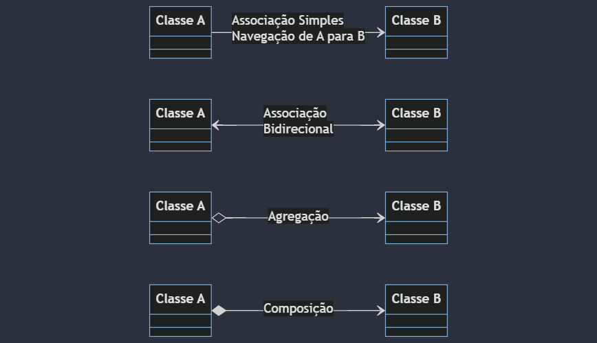
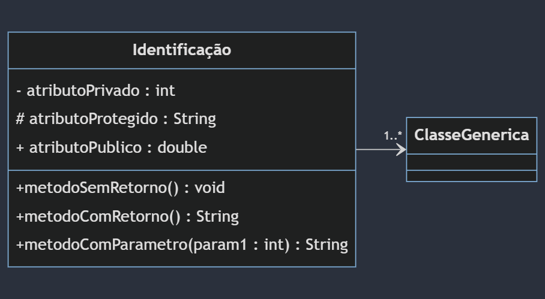

## UML
Linguagem de Modelagem Unificada ou UML é uma notação que possibilita a represrntação gráfica do projeto.

Na UML temos três conceitos necessários para compreendermos inicialmente:
* **Diagramas**
* **Elementos**
* **Relacionamentos**

As notações UML são distribuidas em duas categorias de diagramas, a estrutural e comportamental conforme listagem abaixo:

### Diagramas estruturais**
* **Diagrama de classe**: O Diagrama de Classe é utilizado para fazer a representação de estruturas de classes de negócio, interface e outros componentes do sistema. Por esta caractéristica, este diagrama é considerado o mais importante para a UML, pois auxilia a maioria dos demais diagramas.
* **Diagrama de objetos**: Esta diagrama representa os objetos existentes em um determinado instante ou fato na aplicação. Assim conseguimos ter uma perspectiva do estado de nossos objetos mediante a interação dos usuários do sistema.

> Existem outras categorias de diagramas estruturais e comportamentais, porém iremos focar nos citados acima.

#### Diagrama de classe
O diagrama de classe ilustra **graficamente** como classes serão estruturadas e interligadas entre si diante da proposta do nosso software.

Em diagrama a estrutura das classes é constituída por:
* **Identificação**: Nome e/ou finalidade da classe
* **Atributos**: Proprieadades e/ou caractéristicas
* **Operações**: Ações e/ou métodos

#### Relacionamentos
Em um diagrama as classes podem existir de forma independente, mas obviamente haverá em alguma etapa da aplicação a necessidade de algumas se relacionarem, o que devemos compreender é o nível de dependência entre elas:

##### Associação

Uma associação define um relacionamento entre duas classes, permitindo que um objeto tenha acesso a estrurura de um outro objeto.

* **Agregação**: Em uma agregação a classe principal contém uma relação com outra classe, mas ela pode existir sem a classe agregadora. Imagina em um cadastro de Candidatos, podemos encontrar candidatos que ainda não possuem profissão.
* **Composição**: A composição já caracteriza uma dependência existencial entre a classe principal e a classe associada. Iamginamos que uma Admissão só poderá existir contendo suas informações básicas e a composição do Candidato selecionado.

##### Multiplicidade
Nem sempre o relacionamento entre as classes será de **um para um**, um determinado cenário poderá exigir multiplicidades específicas conforme opções abaixo:
* 1.-> Representa uma associação **contendo um elemento**.
* *. -> Representa uma associação **contendo uma lista de elementos**.
* 0..1 -> Representa uma associação **contendo zero ou um elemento**.
* 0..* -> Representa uma associação **contendo zero ou uma lista de elementos**
* 1..* -> Representa uma associação **contendo um ou uma lista de elementos**

###### Visibilidade
Os atributos e métodos de uma classe podem receber níveis de visibilidade, e na UML existem simbolos que representam cada um dele.
* (+) Visibilidade pública.
* (#) Visibilidade protegida (muito associada com herança)
* (-) Visibilidade privada

##### Representação
