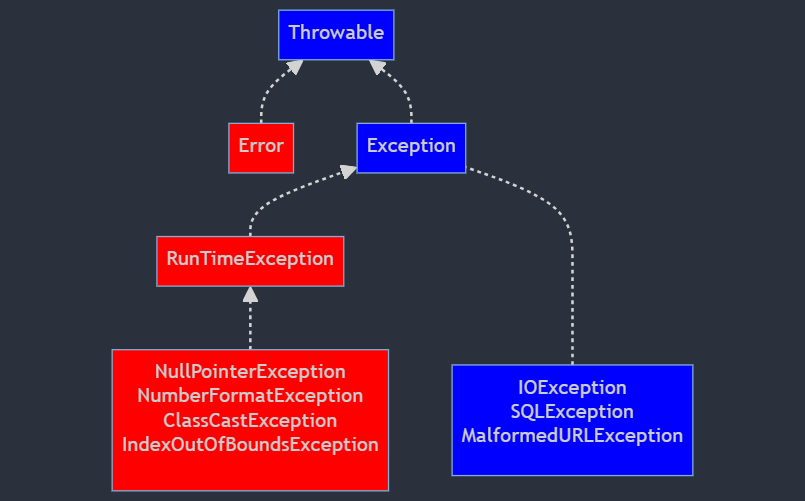

## Estruturas Excepcionais

### Exceções
Ao executar o código Java, diferentes erros podem acontecer: erros de codificação feitos pelo programados, erros devido a entrada errada ou erros imprevistos.

Quando ocorre um erro, o Java normalmente para e gera uma mensagem de erro. Otermo técnico para isso é: Java lançará uma **exceção** (jogará um erro).

De forma interpretativa em Java, um erro é algo irreparável, a aplicação trava ou é encerrada drasticamente. Já exceções é um fluxo inesperado da nossa aplicação, exemplo: Querer dividir um valor por zero, querer abrir um arquivo que não existe, abrir uma conexão de banco com usuário ou senha inválida. Todos estes cenários e os demais não são erros mas sim fluxos não previstos pela aplicação.

É ai que entra mais uma responsabilidade do desenvolvedor, prever situações iguais a estas e realizar o que denominamos de **Tratamento de Exceções**

### Exceções já mapeadas
A linguagem Java dispõe de uma vasta lista de classes que representam exceções, abaixo iremos apresentar as mais comuns:

| Nome                           | Causa                                                                 |
| ------------------------------ | --------------------------------------------------------------------- |
| java.lang.NullPointerException | Quando tentamos obter alguma informação de uma váriavel nula          |
| java.lang.ArithmeticException  | Quando tentamos dividir uma valor por zero                            |
| java.sql.SQLException          | Quando existe algum erro relacionado a interação com o banco de dados |
| java.io.FileNotFoundException  | Quando tentamos ler ou escrever em um arquivo que não existe          |

### Tratamento de exceções
E quando inevitavelmente ocorrer uma exceção? Como nós desenvolvedores podemos ajustar o nosso algoritmo para amenizar o ocorrido?

A instrução **try** permite que você defina um bloco de código para ser testado quanto a erros equanto está sendo executado.

A instrução **catch** permite definir um bloco de código a ser executado caso ocorra um erro no bloco try.

A instrução **finally** permite definir um bloco de código a ser executado independente de ocorrer um erro ou não. As palavras-chave **try** e **catch** vêm em pares.

Estrutura de uma bloco com try catch
``` Java
try{
    // bloco de código conforme esperado
}
catch(Exception e){ // Substituir o Exception pelo tipo de exceção a ser tratada.
    // bloco de código que captura as exceções que podem acontecer
    // em caso de um fluxo não previsto
}
```

### Hierarquia das exceções
A linguagem Java dispõe de uma variedade de classes que representam as exceções, e estas classes são organizadas em uma hierarquia denominadas **Checked and Unchecked Exceptions** ou *Exceções Checadas e Não Checadas.*



O que determinada uma exceção ser classificada como **checada** ou **não checada**?  
É o risco dela ser disparada, logo você precisa tratá-la.

Vamos imaginar que precisamos realizar de duas maneiras a conversão de String para um número, porém o texto contém alfanuméricos.

```Java
public class exception {
    public static void main(String[] args) {
        Number valor = Double.valueOf("a1.75");

        valor = NumberFormat.getInstance().parse("a1.75");

        System.out.println(valor);
    }

}
```

> As linhas 3 e 5 apresentarão uma exceção ao serem executadas, e a linha 5 contém um método que pode disparara uma exceção checada, logo nós programadores que iremos usar este método teremos que tratá-la explicitamente com **try/catch**

### Exceções customizadas
Nós podemos criar nossas próprias exceções baseadas em regras de negócio e assim melhor direcionar quem for utilizar os recursos desenvolvidos no projeto, exemplo:
* Imagina que como regra de négocio, para formatar um cep necessito sempre de ter 8 dígitos, caso contrário lançará uma exceção que denominamos de **CepInvalidoException**.
  
* Primeiro criamos nossa exceção: 
```Java
public class CepInvalidoException extends Exception{}
```
* Em seguida criamos nosso método de formatação de cep.
```Java
public static String formatarCep
```